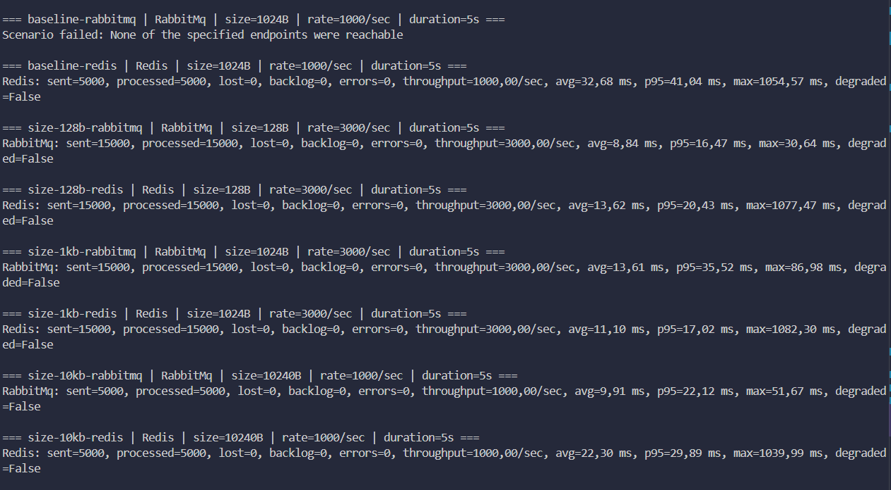
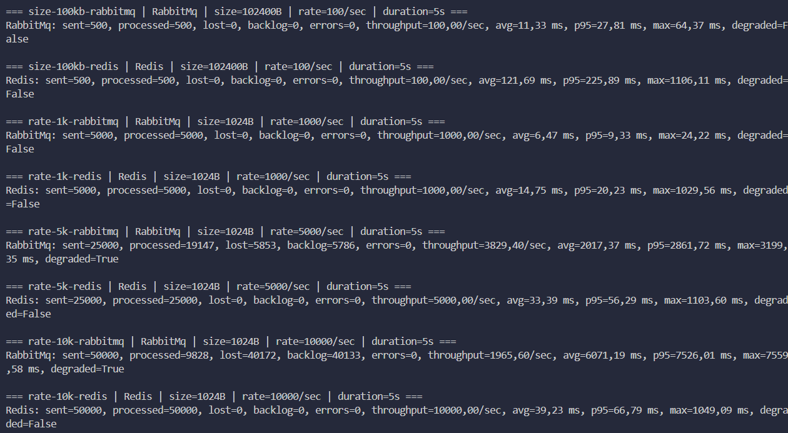

# Отчет по практике: сравнение RabbitMQ и Redis как брокеров сообщений

## Цель

Сравнить `RabbitMQ` и `Redis` в одинаковых условиях по пропускной способности, задержке и устойчивости к росту размера сообщения и интенсивности потока.

## Конфигурация стенда

- 1 `producer`
- 1 `consumer`
- одинаковый JSON-формат сообщений
- `RabbitMQ` и `Redis` запускались через `docker compose`
- для каждой пары сценариев использовались одинаковые длительность теста и параметры нагрузки

## Сценарии

### 1. Базовое сравнение

- `1 KB`, `1000 msg/sec`, `5 sec`

### 2. Влияние размера сообщения

- `128 B`, `3000 msg/sec`, `5 sec`
- `1 KB`, `3000 msg/sec`, `5 sec`
- `10 KB`, `1000 msg/sec`, `5 sec`
- `100 KB`, `100 msg/sec`, `5 sec`

### 3. Влияние интенсивности потока

- `1 KB`, `1000 msg/sec`, `5 sec`
- `1 KB`, `5000 msg/sec`, `5 sec`
- `1 KB`, `10000 msg/sec`, `5 sec`

## Таблица результатов

| Name | Category | Broker | Size | Rate | Sent | Processed | Lost | Backlog | Errors | msg/sec | avg ms | p95 ms | max ms | degraded |
| --- | --- | --- | --- | --- | --- | --- | --- | --- | --- | --- | --- | --- | --- | --- |
| baseline-rabbitmq | baseline | RabbitMq | 1024 B | 1000/sec | 5000 | 5000 | 0 | 0 | 0 | 1000.00 | 3.84 | 5.02 | 56.46 | False |
| baseline-redis | baseline | Redis | 1024 B | 1000/sec | 5000 | 5000 | 0 | 0 | 0 | 1000.00 | 9.61 | 13.23 | 1107.77 | False |
| size-128b-rabbitmq | payload-size | RabbitMq | 128 B | 3000/sec | 15000 | 15000 | 0 | 0 | 0 | 3000.00 | 4.97 | 8.21 | 20.57 | False |
| size-128b-redis | payload-size | Redis | 128 B | 3000/sec | 15000 | 15000 | 0 | 0 | 0 | 3000.00 | 6.53 | 8.99 | 1036.24 | False |
| size-1kb-rabbitmq | payload-size | RabbitMq | 1024 B | 3000/sec | 15000 | 15000 | 0 | 0 | 0 | 3000.00 | 6.93 | 16.81 | 65.59 | False |
| size-1kb-redis | payload-size | Redis | 1024 B | 3000/sec | 15000 | 15000 | 0 | 0 | 0 | 3000.00 | 4.17 | 5.38 | 1052.33 | False |
| size-10kb-rabbitmq | payload-size | RabbitMq | 10240 B | 1000/sec | 5000 | 5000 | 0 | 0 | 0 | 1000.00 | 5.67 | 12.48 | 35.88 | False |
| size-10kb-redis | payload-size | Redis | 10240 B | 1000/sec | 5000 | 5000 | 0 | 0 | 0 | 1000.00 | 4.51 | 5.69 | 1084.18 | False |
| size-100kb-rabbitmq | payload-size | RabbitMq | 102400 B | 100/sec | 500 | 500 | 0 | 0 | 0 | 100.00 | 6.34 | 13.19 | 44.97 | False |
| size-100kb-redis | payload-size | Redis | 102400 B | 100/sec | 500 | 500 | 0 | 0 | 0 | 100.00 | 59.50 | 92.07 | 1074.94 | False |
| rate-1k-rabbitmq | stream-rate | RabbitMq | 1024 B | 1000/sec | 5000 | 5000 | 0 | 0 | 0 | 1000.00 | 3.35 | 4.11 | 15.32 | False |
| rate-1k-redis | stream-rate | Redis | 1024 B | 1000/sec | 5000 | 5000 | 0 | 0 | 0 | 1000.00 | 5.26 | 6.99 | 1009.52 | False |
| rate-5k-rabbitmq | stream-rate | RabbitMq | 1024 B | 5000/sec | 25000 | 25000 | 0 | 0 | 0 | 5000.00 | 6.60 | 10.15 | 24.08 | False |
| rate-5k-redis | stream-rate | Redis | 1024 B | 5000/sec | 25000 | 25000 | 0 | 0 | 0 | 5000.00 | 9.84 | 16.29 | 1084.63 | False |
| rate-10k-rabbitmq | stream-rate | RabbitMq | 1024 B | 10000/sec | 50000 | 23638 | 26362 | 26324 | 0 | 4727.60 | 3850.80 | 4699.06 | 4729.02 | True |
| rate-10k-redis | stream-rate | Redis | 1024 B | 10000/sec | 50000 | 50000 | 0 | 0 | 0 | 10000.00 | 15.36 | 23.30 | 1031.86 | False |

## Выводы

1. В базовом сравнении на `1 KB` и `1000 msg/sec` оба брокера обработали все сообщения без потерь, но `RabbitMQ` показал меньшую среднюю задержку: `3.84 ms` против `9.61 ms`.
2. Для маленьких сообщений `128 B` лучше показал себя `RabbitMQ`, потому что при одинаковой пропускной способности у него ниже средняя и максимальная задержка.
3. На сообщениях `1 KB` и `10 KB` `Redis` показал меньшую среднюю задержку, но на очень больших сообщениях `100 KB` его задержка выросла до `59.50 ms`, тогда как у `RabbitMQ` она осталась около `6.34 ms`. Значит, в этом стенде `Redis` быстрее деградирует на больших payload.
4. По интенсивности потока `RabbitMQ` начал деградировать на `10000 msg/sec`: обработал только `23638` из `50000` сообщений, оставил backlog `26324` и показал среднюю задержку `3850.80 ms`.
5. `Redis` в этом наборе сценариев выдержал до `10000 msg/sec` без потерь и без backlog, поэтому в данном стенде его предел не был достигнут.
6. Для этой практики удобен собственный `producer`, потому что он дает одинаковый формат сообщений, прозрачную настройку размера payload и скорости отправки, а еще сразу сохраняет результаты в `json`, `csv` и `md`.

## Что приложить при сдаче

- скрин запуска `docker compose up -d`
- скрин запуска `dotnet run`
- этот отчет
- файлы из папки `results`

## Скриншоты

### Запуск и результаты первой части прогонов

### Запуск и результаты второй части прогонов

