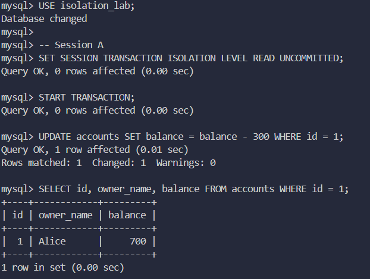
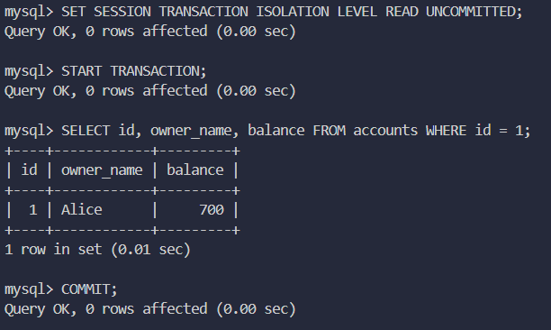
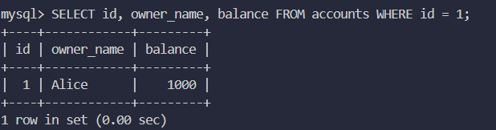
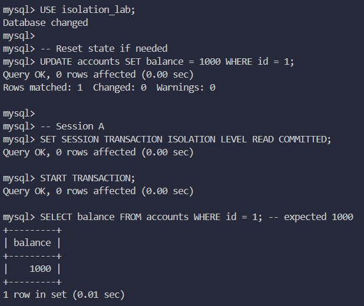
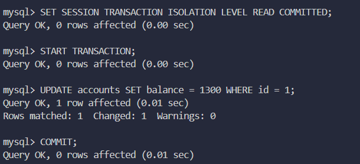
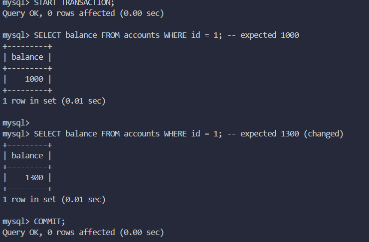

# Отчет по практике 4: аномалии изоляции SQL

## Выбранная СУБД

- MySQL 8+, движок InnoDB.

## Подготовка

1. Открыть 2 SQL-сессии (Session A и Session B).
2. Выполнить `01_setup.sql`.
3. Для каждой аномалии выполнить соответствующий SQL-файл по шагам.

## 1. Dirty Read

- Файл: `02_dirty_read.sql`.
- Уровень изоляции: `READ UNCOMMITTED`.
- Сценарий:
  - Session A меняет баланс и не коммитит.
  - Session B читает это незафиксированное значение.
  - Session A делает `ROLLBACK`.
- Полученный результат:
  - Session B увидела значение `700`, которое затем исчезло после `ROLLBACK` (реальное значение снова `1000`).

Как избежать:
- не использовать `READ UNCOMMITTED`;
- минимум `READ COMMITTED`.

Скриншоты:

Рисунок 1. Session A: изменение баланса без `COMMIT` (получено промежуточное значение `700`).

Рисунок 2. Session B: чтение незафиксированных данных (`700`) при `READ UNCOMMITTED`.

Рисунок 3. Проверка после `ROLLBACK`: итоговое значение снова `1000`.

## 2. Non-repeatable Read

- Файл: `03_non_repeatable_read.sql`.
- Уровень изоляции: `READ COMMITTED`.
- Сценарий:
  - Session A читает строку (`1000`).
  - Session B изменяет строку и коммитит (`1300`).
  - Session A повторно читает ту же строку в рамках той же транзакции и получает уже `1300`.
- Полученный результат:
  - два чтения одной строки в одной транзакции дали разные значения.

Как избежать:
- использовать `REPEATABLE READ` или `SERIALIZABLE`.

Скриншоты:

Рисунок 4. Session A: первое чтение в транзакции, значение `1000`.

Рисунок 5. Session B: изменение значения на `1300` и `COMMIT`.

Рисунок 6. Session A: повторное чтение в той же транзакции, значение изменилось с `1000` на `1300`.

## Что приложить скриншотами

- для каждой аномалии:
  - шаги в Session A и Session B;
  - итоговый `SELECT`, подтверждающий эффект;
- общий скрин выполнения `01_setup.sql`.

## Итог

В работе воспроизведены 2 аномалии изоляции:
- dirty read;
- non-repeatable read.

Для каждой аномалии показан практический сценарий из двух параллельных транзакций и способы предотвращения.
